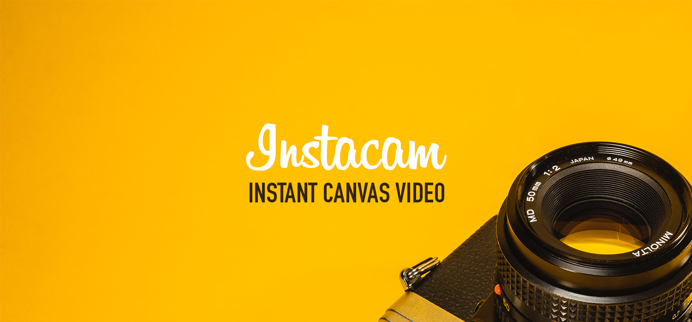

# Instacam – [](https://www.npmjs.com/package/instacam) [](https://bundlephobia.com/result?p=instacam) [](https://github.com/xavierfoucrier/instacam/network/dependencies)
Instacam is a library to perform **instant canvas video** through the WebRTC API with a fresh touch of CSS filters.

[](https://instacam.js.org)


## Compatibility
Instacam is fully tested on **Google Chrome** for desktop *(latest public released version)*. The plugin is compatible with browsers that natively support the HTML5 `canvas` tag, `requestAnimationFrame` API, `HTMLMediaElement` API, `navigator.mediaDevices` and `Promises` API. The CSS filtering requires the `CSS filter` features to properly work.

Official support on **Chrome 52+, Firefox 52+, Edge 15+ and Opera 52+**. Many other browsers may work, but are not extensively tested. You can check at any time the [support table](https://caniuse.com) about the partial or full support of these features.


## Install
Instacam is published on the **NPM** *(Node Package Manager)* registry, so you can install it through the command line interpreter using your favorite package manager:

```console
# npm
npm install instacam

# yarn
yarn add instacam
```

> For other implementation of Instacam in your project, see the [usage documentation](DOCUMENTATION.md#usage)


## Documentation
Here you will find the documentation describing **how to use** the library.

1. [How it works](DOCUMENTATION.md#how-it-works) - how the library do the stuff
2. [Markup](DOCUMENTATION.md#markup) - how should the HTML and CSS look like
3. [Usage](DOCUMENTATION.md#usage) - how to use Instacam
4. [Data attributes](DOCUMENTATION.md#data-attributes) - set of data attributes
5. [Properties](DOCUMENTATION.md#properties) - all available properties
6. [Methods](DOCUMENTATION.md#methods) - all available methods
7. [Callbacks](DOCUMENTATION.md#callbacks) - all available callbacks
8. [Demo](DOCUMENTATION.md#demo) - Instacam in action


## Contribute
If you want to report a bug or if you just want to request for a new feature/improvement, please **read the project [contributors guidelines](CONTRIBUTING.md) before**. Thanks for taking time to contribute to Instacam.


## License
The project is developed under the **MIT** license:

- **Permissions**: This software and derivatives may be used for commercial purposes, you may distribute this software, this software may be modified and you may use and modify the software without distributing it.
- **Conditions**: Include a copy of the license and copyright notice with the code.
- **Limitations**: Software is provided without warranty and the software author/license owner cannot be held liable for damages.

Read the [full license](LICENSE.md) for more information about your rights.


## Questions?
If you have any questions, please **feel free to contact me!**  
[xavier.foucrier [at] gmail.com](mailto:xavier.foucrier@gmail.com)
